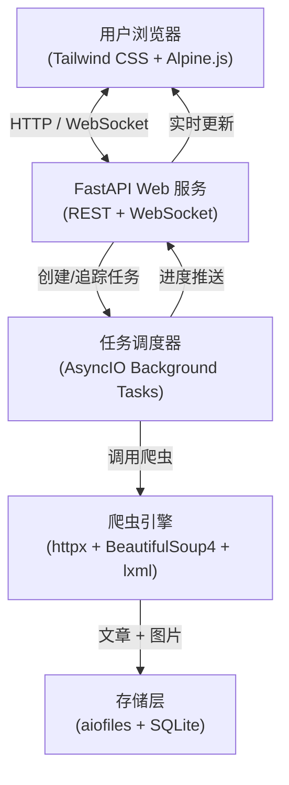
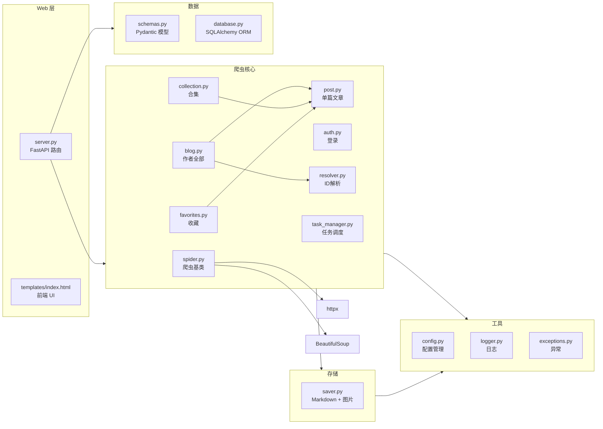
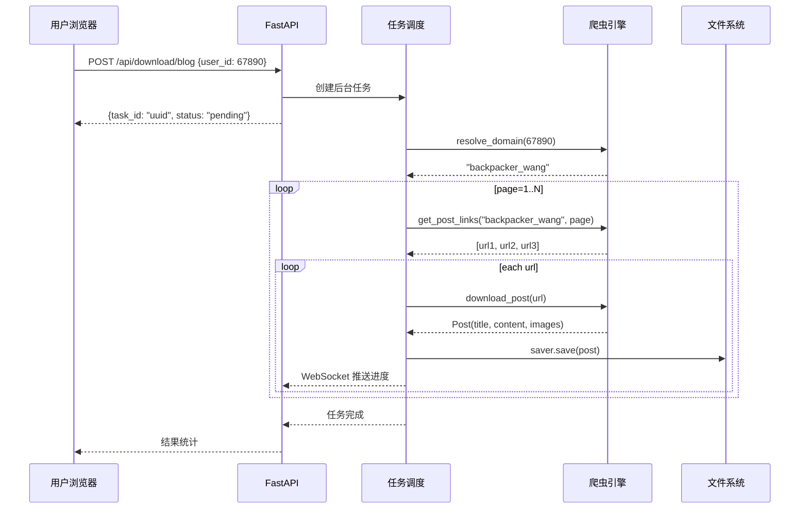

# 架构设计

## 系统架构图



## 模块依赖关系



## 数据流（作者全部文章下载）



## 文件存储结构

```
downloads/
├── {author_name}/
│   ├── {publish_date}_{post_title}/
│   │   ├── index.md
│   │   └── images/
│   │       ├── 001.jpg
│   │       ├── 002.png
│   │       └── ...
│   └── ...
├── 收藏文章/
│   └── ...
└── 单篇下载/
    └── ...
```

## 技术栈

| 层次 | 技术 | 用途 |
|---|---|---|
| 前端 | Tailwind CSS + Alpine.js | 美观零构建 UI |
| 后端 | FastAPI + Uvicorn | 异步 Web 服务 |
| 爬虫 | httpx + BeautifulSoup4 + lxml | HTML 解析 |
| 存储 | aiofiles + SQLite (SQLAlchemy) | 文件 + 数据库 |
| 格式 | Markdown (markdownify) | 文章输出 |
| 测试 | pytest + pytest-cov + pytest-mock | 质量保障 |
| 文档 | MkDocs + mkdocstrings | 自动生成 API 文档 |
| CI/CD | GitHub Actions | 自动化质量检查与发布 |
