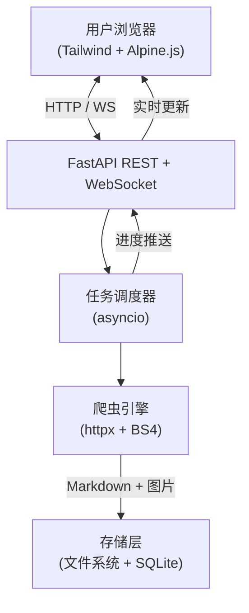

# LOFTER 文章下载器 — 系统设计方案

> 版本：0.1.0 | 更新日期：2026-05-24

---

## 一、项目概述

### 1.1 项目目标

开发一款专门针对网易 LOFTER（乐乎）平台的文章下载软件，支持以下四类下载场景：

| 编号 | 功能 | 说明 | 登录要求 |
|---|---|---|---|
| F1 | 下载用户收藏的全部文章 | 访问 LOFTER 收藏页，遍历所有收藏文章 | ✅ 必须 |
| F2 | 下载合集中全部文章 | 根据合集链接，自动检索并下载合集内文章 | ❌ 无需 |
| F3 | 下载作者全部文章 | 根据用户数字 ID，下载该作者所有公开发布文章 | ❌ 无需 |
| F4 | 下载单篇文章 | 根据文章链接下载单篇 | ❌ 无需 |

### 1.2 技术栈

| 层次 | 技术选型 | 说明 |
|---|---|---|
| 语言 | Python >= 3.10 | 类型注解 + asyncio 异步 |
| Web 框架 | FastAPI + Uvicorn | 后端服务 |
| 前端 | Tailwind CSS + Alpine.js | 零构建工具，CDN 引入 |
| 爬虫 | httpx + BeautifulSoup4 + lxml | 异步 HTTP + HTML 解析 |
| 存储 | aiofiles + SQLite（SQLAlchemy） | 文件系统 + 数据库 |
| 格式 | Markdown（markdownify 转换） | 文章输出格式 |
| 测试 | pytest + pytest-cov + pytest-mock | 测试基础设施 |
| 文档 | MkDocs + mkdocstrings | 自动生成 API 文档 |
| CI/CD | GitHub Actions | 自动化质量检查与发布 |

### 1.3 项目结构

```
lofter-downloader/
├── pyproject.toml              # 项目元数据、依赖、工具配置
├── noxfile.py                  # Nox 多版本测试
├── Dockerfile                  # Docker 镜像构建
├── .env.example                # 环境变量模板
├── .github/workflows/
│   ├── ci.yml                  # CI：lint + typecheck + test
│   └── cd.yml                  # CD：发布至 PyPI / Docker
│
├── docs/
│   ├── mkdocs.yml
│   ├── index.md
│   └── ...
│
├── tests/
│   ├── conftest.py
│   ├── unit/
│   ├── integration/
│   ├── e2e/
│   └── fixtures/
│
└── src/
    └── lofter_downloader/
        ├── __init__.py
        ├── __main__.py
        ├── config.py              # pydantic-settings 配置
        ├── core/
        │   ├── spider.py          # 爬虫基类（异步 + 限速 + 重试）
        │   ├── auth.py            # 登录模块（Cookie / 模拟登录）
        │   ├── resolver.py        # 数字 ID ↔ 博客域名 解析
        │   ├── post.py            # F4：单篇文章下载
        │   ├── blog.py            # F3：作者全部文章下载
        │   ├── collection.py      # F2：合集下载
        │   ├── favorites.py       # F1：收藏下载
        │   └── task_manager.py    # 异步任务调度
        ├── storage/
        │   └── saver.py           # Markdown + 图片存储
        ├── models/
        │   ├── schemas.py         # Pydantic 数据模型
        │   └── database.py        # SQLAlchemy ORM
        ├── web/
        │   ├── server.py          # FastAPI 应用
        │   ├── routes/            # API 路由
        │   ├── templates/         # Jinja2 模板
        │   └── static/            # CSS / JS
        └── utils/
            ├── logger.py          # logging 配置
            └── exceptions.py      # 自定义异常层次
```

---

## 二、架构设计

### 2.1 系统架构图



### 2.2 数据流（以下载作者全部文章为例）

```mermaid
sequenceDiagram
    participant User as 用户浏览器
    participant API as FastAPI
    participant Task as 任务调度
    participant Spider as 爬虫引擎
    participant Files as 文件系统

    User->>API: POST /api/download/blog {user_id: 123456}
    API->>Task: 创建后台任务
    API-->>User: {task_id: "uuid", status: "pending"}

    Task->>Spider: resolve_blog_domain(123456) → "abc"
    Spider-->>Task: blog = "abc.lofter.com"

    loop page=1..N
        Task->>Spider: get_post_links("abc", page)
        Spider-->>Task: [url1, url2, ...]

        loop each url
            Task->>Spider: download_post(url)
            Spider-->>Task: Post(title, content, images)
            Task->>Files: saver.save(post)
            Task-->>API: WebSocket 推送进度
        end
    end

    Task-->>API: 任务完成
    API-->>User: 结果统计
```



### 2.3 文件存储结构

```
downloads/
├── {author_name}/
│   ├── {publish_date}_{post_title}/
│   │   ├── index.md               ← Markdown 正文
│   │   └── images/
│   │       ├── 001.jpg
│   │       ├── 002.png
│   │       └── ...
│   └── ...
├── 收藏文章/
│   └── ...
└── 单篇下载/
    └── ...
```

### 2.4 Markdown 输出模板

```markdown
# 文章标题

- **作者**: 作者名
- **发布日期**: 2024-01-01
- **原文链接**: https://xxx.lofter.com/post/xxx_xxx

---

文章正文内容...


```

---

## 三、模块详细设计

### 3.1 `config.py` — 配置管理

基于 `pydantic-settings` 管理全部配置，支持 `.env` 文件和环境变量覆盖。

| 配置项 | 类型 | 默认值 | 说明 |
|---|---|---|---|
| `download_dir` | `Path` | `~/lofter_downloads` | 下载存储根目录 |
| `request_interval` | `float` | `1.5` | 请求间隔（秒） |
| `max_retries` | `int` | `3` | 最大重试次数 |
| `request_timeout` | `int` | `30` | 请求超时（秒） |
| `cookie` | `str` | `""` | 登录 Cookie（敏感信息） |
| `db_path` | `Path` | `~/.lofter_downloader/data.db` | 数据库路径 |
| `log_level` | `str` | `"INFO"` | 日志级别 |
| `max_concurrency` | `int` | `3` | 最大并发请求数 |

### 3.2 `core/spider.py` — 爬虫基类

**职责：** 封装统一的 HTTP 请求、重试、限速、HTML 解析逻辑。

- 继承 `ABC`，子类需实现 `run()` 方法
- 使用 `asyncio.Semaphore` 控制并发
- 自动重试（指数退避）
- 统一的 User-Agent 和超时配置

### 3.3 `core/post.py` — 单篇文章下载（F4）

**职责：** 解析单篇 LOFTER 文章页面，提取标题、作者、日期、正文、图片。

- 输入：文章完整 URL
- 输出：`Post` 数据类对象

### 3.4 `core/blog.py` — 作者全部文章（F3）

**职责：** 根据用户数字 ID，解析博客域名，遍历全部分页获取所有文章。

- 输入：用户数字 ID
- 输出：`list[Post]`
- 实现步骤：
  1. `resolver.resolve_blog_domain(user_id)` → 域名
  2. 获取博客总页数
  3. 遍历 `page=1..N` 提取文章链接
  4. 逐篇下载

### 3.5 `core/collection.py` — 合集下载（F2）

**职责：** 解析合集页面，获取合集内所有文章并下载。

- 输入：合集 URL
- 输出：`list[Post]`

### 3.6 `core/favorites.py` — 收藏下载（F1）

**职责：** 在已登录状态下，获取用户收藏页面的所有文章并下载。

- 输入：无（依赖已保存的登录态）
- 输出：`list[Post]`
- 需要先通过 `auth.py` 验证登录状态

### 3.7 `core/auth.py` — 登录模块

**职责：** 管理 LOFTER 登录会话。

- **Cookie 导入：** 用户从浏览器复制 Cookie → 加密存储到 SQLite
- **会话验证：** 请求 `www.lofter.com` 检查登录态
- **会话持久化：** 加密保存，下次启动自动加载
- ~~模拟登录：~~ 作为降级方案，因网易通行证有验证码/滑块，不保证成功

### 3.8 `core/resolver.py` — ID 解析模块

**职责：** 实现用户数字 ID 与博客域名之间的双向解析。

- 原理：请求 LOFTER 页面，解析 `<script>` 标签中的 `window.globalData`

### 3.9 `core/task_manager.py` — 任务调度

**职责：** 管理所有下载任务的创建、进度追踪、取消和历史查询。

- `create_task(type, params)` → `task_id`
- `get_progress(task_id)` → `Progress`
- `cancel_task(task_id)`
- `get_history()` → `list[Task]`
- 通过 WebSocket 推送实时进度

### 3.10 `storage/saver.py` — 存储模块

**职责：** 将 `Post` 对象保存到文件系统。

- 按作者/合集组织文件夹
- 正文保存为 Markdown（`index.md`）
- 图片异步下载到 `images/` 子目录

### 3.11 `models/schemas.py` — 数据模型

Pydantic 模型用于 API 请求/响应校验：

```python
class DownloadPostRequest(BaseModel):
    url: HttpUrl

class DownloadBlogRequest(BaseModel):
    user_id: int

class DownloadCollectionRequest(BaseModel):
    url: HttpUrl

class TaskResponse(BaseModel):
    task_id: str
    status: str
    progress: float
    created_at: datetime

class LoginCookieRequest(BaseModel):
    cookie: str
```

### 3.12 `models/database.py` — 数据库

SQLite + SQLAlchemy，存储任务历史记录和加密的登录会话。

- `Task` 表：ID、类型、参数、状态、进度、结果统计、创建时间
- `LoginSession` 表：ID、加密 Cookie、有效性标记、更新时间

---

## 四、API 接口设计

| 方法 | 路径 | 请求体 | 响应 | 说明 |
|---|---|---|---|---|
| `POST` | `/api/login/cookie` | `{cookie: str}` | `{ok: bool}` | 导入 Cookie |
| `POST` | `/api/login/account` | `{username, password}` | `{ok: bool}` | 账号登录 |
| `GET` | `/api/login/status` | — | `{logged_in: bool}` | 检查登录态 |
| `DELETE` | `/api/login` | — | `{ok: bool}` | 清除登录信息 |
| `POST` | `/api/download/post` | `{url: str}` | `{task_id}` | 下载单篇 |
| `POST` | `/api/download/blog` | `{user_id: int}` | `{task_id}` | 下载全部 |
| `POST` | `/api/download/collection` | `{url: str}` | `{task_id}` | 下载合集 |
| `POST` | `/api/download/favorites` | `{}` | `{task_id}` | 下载收藏 |
| `GET` | `/api/tasks/{task_id}` | — | `TaskResponse` | 查询任务 |
| `POST` | `/api/tasks/{task_id}/cancel` | — | `{ok: bool}` | 取消任务 |
| `GET` | `/api/tasks` | — | `list[TaskResponse]` | 历史列表 |
| `WS` | `/api/ws/{task_id}` | — | 实时进度帧 | WebSocket 推送 |
| `GET` | `/api/stats` | — | `{total, success, failed}` | 下载统计 |

---

## 五、测试架构

### 5.1 测试金字塔

```
         ╱╲
        ╱  ╲          E2E 测试（少量）
       ╱    ╲
      ╱──────╲
     ╱        ╲      集成测试（适中）
    ╱          ╲
   ╱────────────╲
  ╱              ╲   单元测试（大量）
 ╱────────────────╲
```

### 5.2 测试策略

| 层次 | 工具 | 测试对象 | 覆盖率目标 |
|---|---|---|---|
| 单元测试 | pytest + pytest-mock | 每个函数/类的独立逻辑 | > 90% |
| 集成测试 | pytest + httpx (mock) | 模块间协作、API 端点 | > 80% |
| E2E 测试 | pytest + 真实网络（标记） | 完整下载流水线 | 关键路径 |

### 5.3 测试文件

```
tests/
├── conftest.py                    # 全局 fixtures
│   ├── mock_http_client()         # 使用 respx 拦截 HTTP
│   ├── temp_download_dir()        # tmp_path 临时目录
│   └── sample_post_html()         # 从 fixtures/ 加载样本
│
├── unit/
│   ├── test_spider.py             # 请求/重试/限速
│   ├── test_post.py               # 文章解析
│   ├── test_blog.py               # 翻页和 ID 解析
│   ├── test_collection.py         # 合集解析
│   ├── test_resolver.py           # ID 映射
│   ├── test_auth.py               # Cookie 管理
│   └── test_saver.py              # 文件存储
│
├── integration/
│   ├── test_download_flow.py      # 完整下载流程
│   └── test_api_endpoints.py      # FastAPI TestClient
│
├── e2e/
│   └── test_full_pipeline.py      # 真实网络（@pytest.mark.e2e）
│
└── fixtures/
    ├── post_page.html
    ├── blog_page.html
    └── collection_page.html
```

---

## 六、文档体系

### 6.1 MkDocs 配置

```yaml
site_name: LOFTER 下载器
theme:
  name: material
  palette:
    - scheme: default
      primary: indigo
      toggle:
        icon: material/weather-night
        scheme: slate
  features:
    - navigation.tabs
    - content.code.copy
plugins:
  - search
  - mkdocstrings:
      handlers:
        python:
          paths: [src]
          options:
            docstring_style: numpy
            show_source: true
```

### 6.2 文档结构

```
docs/
├── index.md             # 项目介绍 + 截图
├── quickstart.md        # 快速开始
├── login.md             # Cookie 导入说明
├── faq.md               # 常见问题
├── api/                 # 自动生成
│   ├── core.md
│   ├── storage.md
│   └── web.md
├── developer.md         # 开发者指南
├── architecture.md      # 架构图
└── changelog.md         # 变更日志
```

---

## 七、CI/CD 流水线

### 7.1 CI 流水线

每次 push / PR 触发：

1. 检出代码
2. 配置 Python（3.10 / 3.11 / 3.12 矩阵）
3. 安装依赖 `pip install -e ".[dev,docs]"`
4. Ruff 代码检查
5. mypy 类型检查
6. pytest 测试 + 覆盖率
7. 上传覆盖率报告至 Codecov
8. MkDocs 构建文档（strict 模式）

### 7.2 CD 流水线

推送 `v*` tag 触发：

1. 构建 Python 包（`python -m build`）
2. 发布至 PyPI（可信发布）
3. 构建 Docker 镜像

---

## 八、实施路线图

| 阶段 | 内容 | 核心文件数 |
|---|---|---|
| **P0** 项目骨架 | pyproject.toml、配置、日志、异常、入口 | 8 |
| **P1** 爬虫引擎 | 爬虫基类、单篇下载、存储模块、ID 解析 | 5 |
| **P2** 批量下载 | 作者全部文章、合集、收藏 + 任务调度 | 5 |
| **P3** Web 服务 | FastAPI 应用、路由、数据库 | 6 |
| **P4** 前端 UI | HTML 模板、Alpine.js 交互、Tailwind 样式 | 4 |
| **P5** 测试 | 单元/集成/E2E 测试 + fixtures | 15+ |
| **P6** 文档 + CI/CD | MkDocs、ci.yml、cd.yml、changelog | 6 |
| **P7** 打磨 | Dockerfile、暗黑模式、动效 | 3 |

---

## 九、风险与应对

| 风险 | 应对方案 |
|---|---|
| LOFTER 页面结构变更 | 爬虫基类集中解析逻辑，CSS 选择器配置化 |
| 反爬机制（限流/封 IP） | 请求间隔 + 随机 UA + 重试 + 用户可调参数 |
| 模拟登录困难 | 优先 Cookie 导入，模拟登录作为降级 |
| 数字 ID 解析不稳定 | 备用方案：用户手动输入博客域名 |

---

## 十、编码规范

- **代码风格：** Black（行宽 88）、Ruff 检查
- **类型注解：** mypy strict 模式
- **文档字符串：** NumPy 风格
- **日志：** 使用 `logging` 模块，禁止 `print`
- **异常：** 自定义异常层次，边界统一处理
- **并发：** IO 密集型用 asyncio，CPU 密集型用多进程
- **敏感信息：** 环境变量 / .env 文件，禁止硬编码
